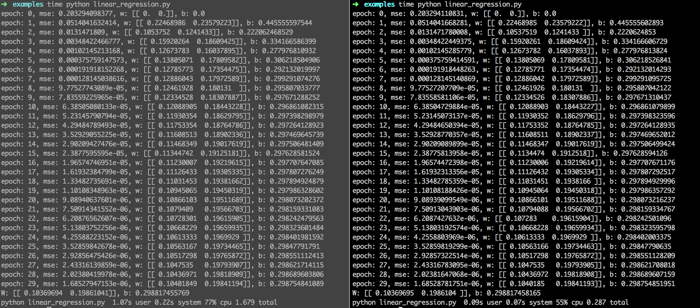

# toytensorflow
A toy of tensorflow for exploring the core of tf, including operation, DAG, session and optimizer.

### Support
- [x] Vectorized operations
- [x] DAG
- [x] Automatic partial derivative and chain rule
- [x] Back Propagation
- [x] GradientDescent Optimizer
- [x] Vectorization Linear Regression

### Example
```python
import toytensorflow as tf
import numpy as np

#real data
x_data = np.float32(np.random.rand(2,100) )
y_data = np.dot([0.1,0.2], x_data) + 0.3

#ops & DAG
W = tf.Variable([[0.0,0.0] ], name='weight')
b = tf.Variable(0.0, name='bias')
X = tf.placeholder(tf.float32)
Y = tf.placeholder(tf.float32)
predict = tf.matmul(W, X) + b

loss = tf.reduce_mean(tf.square(predict - Y) )
learning_rate = 0.5
optimizer = tf.train.GradientDescentOptimizer(learning_rate)
train_op = optimizer.minimize(loss)

init = tf.initialize_all_variables()
#run
feed_dict = {X:x_data, Y:y_data}
with tf.Session() as sess:
    sess.run(init)
    for epoch in range(30):
        mse = sess.run(loss, feed_dict=feed_dict)
        print 'epoch: {}, mse: {}, w: {}, b: {}'.format(epoch, mse, sess.run(W), sess.run(b))
        sess.run(train_op, feed_dict=feed_dict)
    w_value = sess.run(W, feed_dict=feed_dict)
    b_value = sess.run(b, feed_dict=feed_dict)
    print('W: {}, b: {}'.format(w_value, b_value) )
```
The APIs and performance of tensorflow vs toytensorflow are the same. The right one is toytensorflow.


### Todo
* More operations
* More optimizers, eg momentum/adam/adagrad
* More examples, eg logisticregression/mlp
